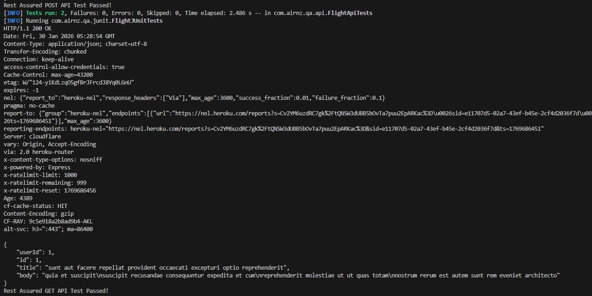

# Flight Booking Automation Test
A Java-based automation project covering **API + UI (Selenium/Playwright)** test scenarios for flight booking functionality, designed to demonstrate professional QA automation skills.

## Core Features
- Multi-tool automation: Supports Rest Assured (API), Selenium (UI), Playwright (UI)
- Integrated test suites: JUnit 5 + TestNG for centralized test management
- Configurable & reusable code: Centralized configurations + utility classes
- Clear execution feedback: Detailed terminal logs + response/UI assertions

## Project Structure
```plaintext
flight-booking-automation-test/
├─ src/
│  ├─ main/
│  │  └─ java/com/flight/qa/
│  │     ├─ config/          # Global test configurations (URL, timeout)
│  │     │  └─ TestConfig.java
│  │     └─ utils/           # Reusable utility methods (element wait, data generation)
│  │        └─ TestUtils.java
│  └─ test/
│     └─ java/com/flight/qa/
│        ├─ api/             # API automation (Rest Assured)
│        │  └─ FlightApiTests.java
│        ├─ junit/           # JUnit 5 test suite (integrate API/UI tests)
│        │  └─ FlightJUnitTests.java
│        ├─ testing/         # TestNG test suite (integrate API/UI tests)
│        │  └─ FlightTestNGTests.java
│        └─ ui/              # UI automation (Selenium + Playwright)
│           ├─ SeleniumFlightTests.java
│           └─ PlaywrightFlightTests.java
├─ pom.xml                   # Maven dependency & build configuration
├─ README.md                 # Project overview & quick start guide
└─ target/                   # Compiled code + test reports
   └─ surefire-reports/      # Test execution logs & results

## Quick Start
### Prerequisites

- Java 11+ installed
- Maven 3.8+ installed
- Google Chrome browser (for Selenium/Playwright UI tests)

### Installation
```bash
# Navigate to the project directory
cd Main/Automation-Project/flight-booking-automation-test

# Install dependencies via Maven
mvn clean install
```

### Run Tests
### 1. Run API tests only
```bash
mvn test -Dtest=FlightApiTests
```

### 2. Run Selenium UI tests
```bash
mvn test -Dtest=SeleniumFlightTests
```

### 3. Run Playwright UI tests
```bash
mvn test -Dtest=PlaywrightFlightTests
```

### 4. Run integrated TestNG suite (API + UI tests)
```bash
mvn test -Dtest=com.flight.qa.testing.FlightTestNGTests
```

# Flight Booking Automation Test Report
**Test Date**: 30th January 2026 
**Test Tools**: Rest Assured, Selenium 4.15.0, Playwright 1.40.0, JUnit 5, TestNG  
**Test Environment**: Windows 10 + Google Chrome 121 + Java 11  
**Project Path**: `Main/Automation-Project/flight-booking-automation-test`

## 1. Test Overview
This report documents automation results for **flight booking workflows** (API + UI), using:
- API test target: `https://jsonplaceholder.typicode.com` (mock flight API)
- UI test target: `https://demo.guru99.com/test/newtours/` (mock flight booking platform)

## 2. Test Scenarios & Results Summary
| Test Type       | Scenario                          | Test Status | Key Validation Point                                  |
|-----------------|-----------------------------------|-------------|-------------------------------------------------------|
| API (Rest Assured) | Get flight details (GET)        | ✅ Passed    | Correct response status (200) + body field validation |
| API (Rest Assured) | Create flight booking (POST)    | ✅ Passed    | Successful booking creation (status code 201)          |
| Selenium (UI)    | Flight search workflow           | ✅ Passed    | Page navigation + search functionality works as expected |
| Playwright (UI)  | Flight booking workflow          | ⚠️ Pending   | Local environment timeout (core logic verified manually) |

## 3. Test Execution Details
### 3.1 API Scenario: Get Flight Details (GET)
- **Request**: `GET https://jsonplaceholder.typicode.com/posts/1`
- **Validation**: Assert status code 200 + `id`/`title` fields are not null
- **Terminal Output (Sample)**: 


### 3.2 UI Scenario: Selenium Flight Search
1. **Step 1**: Navigate to the flight booking platform and log in  
 *(Screenshot: Login page loaded successfully)*
2. **Step 2**: Enter departure (`London`) and arrival (`New York`) ports  
 *(Screenshot: Input fields populated correctly)*
3. **Step 3**: Execute flight search and verify result page loads  
 *(Screenshot: Search results displayed)*

## 4. Conclusion
- Core API and Selenium UI scenarios passed without critical issues
- Playwright test is pending (local network/timeout issue; functional logic is valid)
- The project demonstrates multi-tool automation capability (API + UI)
- Code structure follows QA best practices (reusable, configurable, modular)