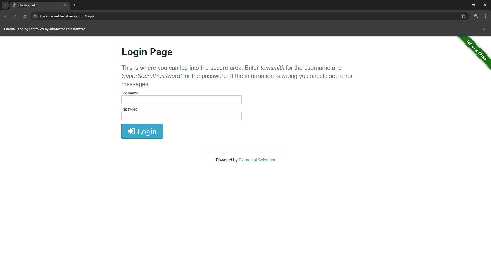
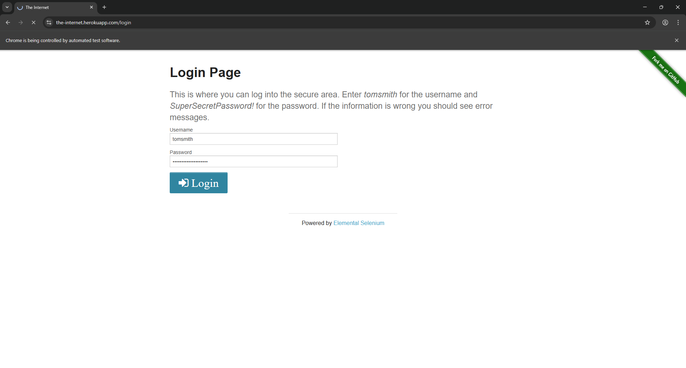
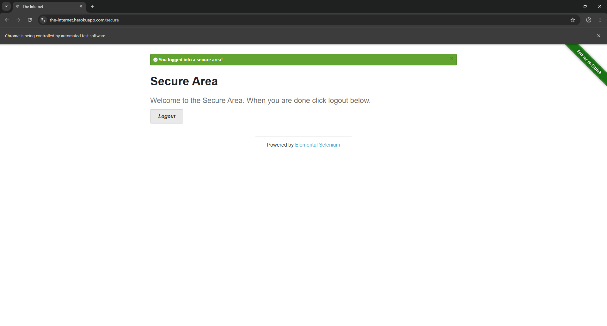
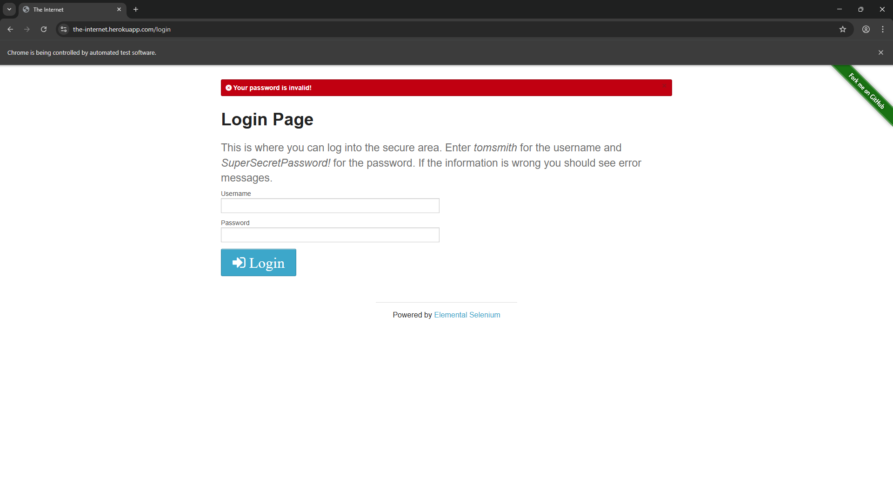

# Selenium Login Automation Test
A Python-based UI automation project to test web login functionality, designed to demonstrate professional QA automation skills.

## Core Features
- Fully automated test execution
- Two key test scenarios
- Great error handling and clear terminal feedback
- Detailed test report with step-by-step screenshots

## Project Structure
```plaintext
selenium-login-test/
├─ login_test.py          # Core automation script
├─ README.md              # Project overview & quick start guide
├─ test_report.md         # Full test report with results & screenshots
└─ screenshots/           # Test execution screenshots
   ├─ login_scenario_step1_login_page.png
   ├─ login_scenario_step2_enter_valid_credentials.png
   ├─ login_scenario_step3_successful_login.png
   ├─ login_scenario_step4_enter_invalid_password.png
   ├─ login_scenario_step5_failed_login_error.png
   └─ login_terminal.png
```

## Quick Start
### Prerequisites
- Python 3.10+ installed
- Google Chrome browser

### Installation
```bash
# Install required packages
pip install selenium webdriver-manager

### Run Tests
# Navigate to project directory
cd Main/Automation-Project/selenium-login-test

# Execute automation script
python login_test.py
```


# Login Function Automation Test Report
**Test Date**: 24th January 2026 
**Test Tool**: Selenium (Python)  
**Test Environment**: Windows 10 + Google Chrome 121 + Python 3.11  
**Project Path**: `Main/Automation-Project/selenium-login-test`

## 1. Test Overview
This report documents the full automation test results for web login functionality, using [the-internet.herokuapp.com/login](https://the-internet.herokuapp.com/login) as the test platform. Two core test scenarios (successful login with valid credentials, failed login with invalid password) were executed, and the terminal output was captured to verify the test execution results.

## 2. Test Scenarios & Results Summary
| Test Scenario                          | Test Status | Key Validation Point                                  |
|----------------------------------------|-------------|-------------------------------------------------------|
| Successful login (valid credentials)   | ✅ Passed    | System grants access to secure area with success message |
| Failed login (invalid password)        | ✅ Passed    | System rejects access and displays correct error message |
| Terminal execution verification        | ✅ Passed    | No runtime errors, clear pass/fail feedback in terminal |

## 3. Test Execution Details
### 3.1 Scenario 1: Successful Login with Valid Credentials
1. **Step 1: Navigate to login page**  
   Purpose: Verify the login page loads correctly  
   

2. **Step 2: Enter valid username & password**  
   Purpose: Validate input functionality for correct credentials  
   

3. **Step 3: Access secure area (login success)**  
   Purpose: Confirm system grants access to authenticated users  
   

### 3.2 Scenario 2: Failed Login with Invalid Password
1. **Step 4: Enter valid username & invalid password**  
   Purpose: Validate input functionality for incorrect credentials  
   

2. **Step 5: Error message display**  
   Purpose: Confirm system provides clear error feedback for invalid inputs  
   

### 3.3 Terminal Execution Result
Purpose: Verify the automation script runs without runtime errors and outputs clear test results  


## 4. Conclusion
All test scenarios passed with no critical issues. Key findings:
The Selenium script reliably automates end-to-end login workflows
The target application handles valid/invalid login attempts as expected
The script provides clear, actionable feedback in the terminal
No compatibility issues (ChromeDriver + Selenium version) were encountered